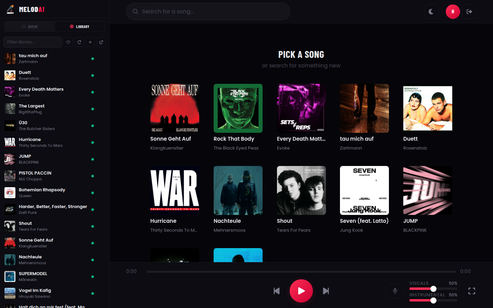
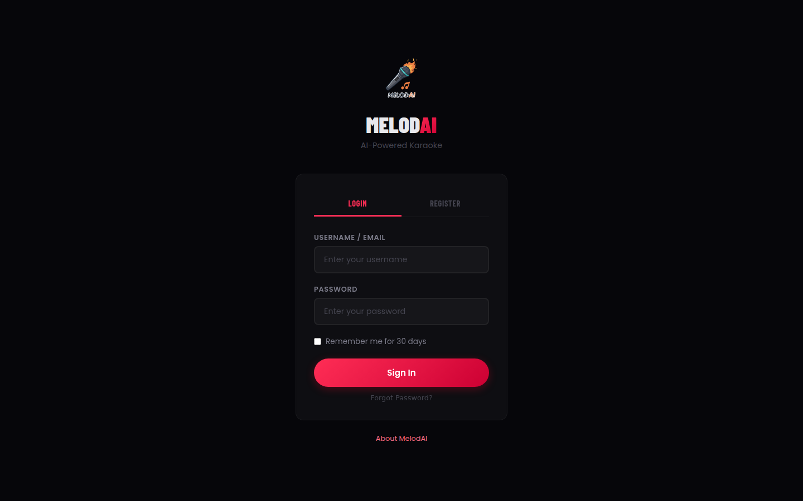
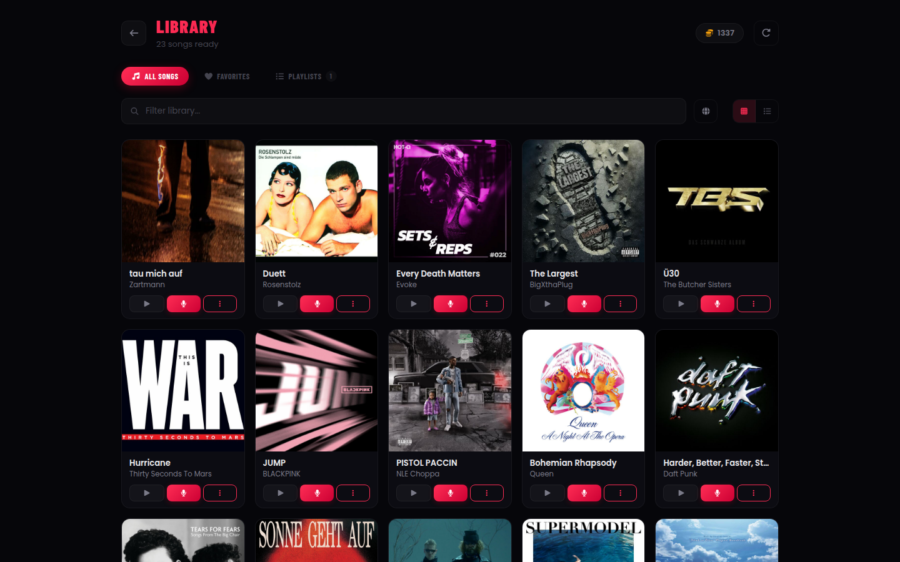
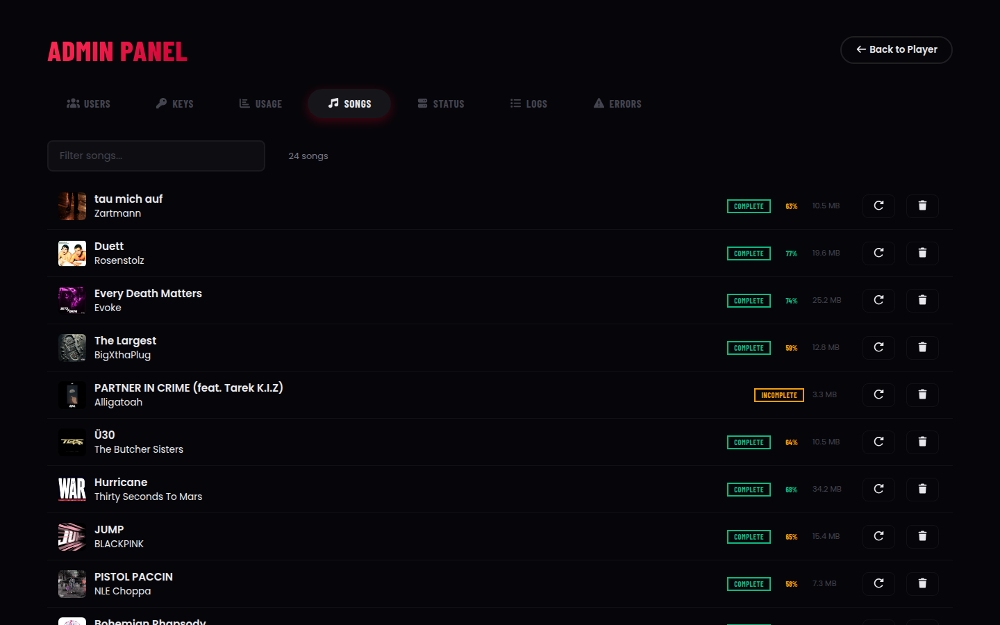
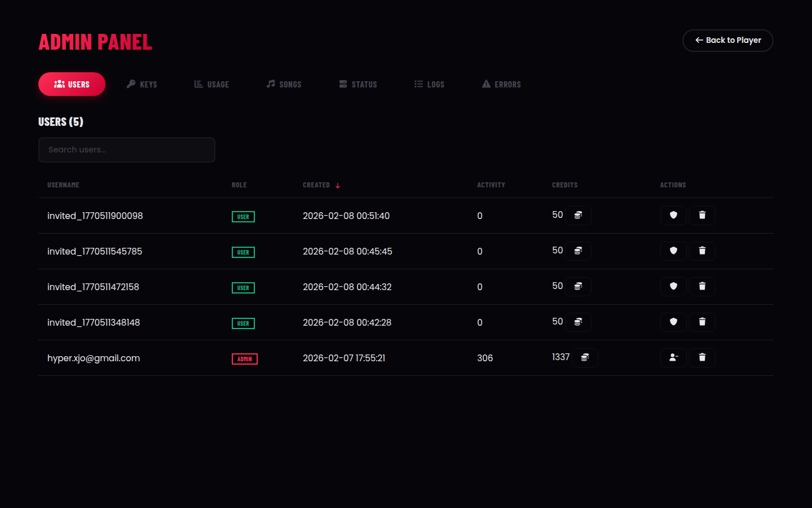
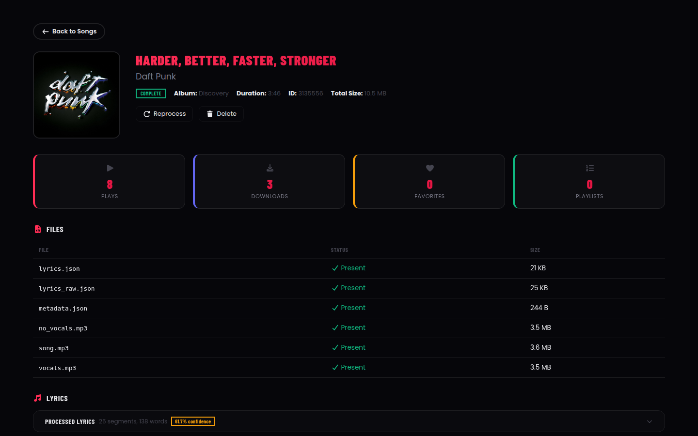
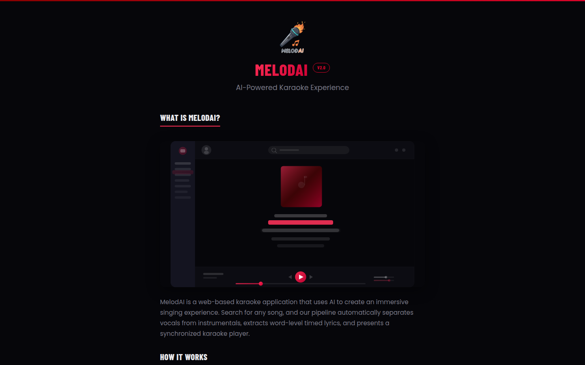

# MelodAI

[](https://github.com/LoggeL/MelodAI/actions/workflows/ci.yml)
[](https://github.com/LoggeL/MelodAI/actions/workflows/codeql.yml)
[](LICENSE)
[](https://www.typescriptlang.org/)
[](https://flask.palletsprojects.com/)

**Open-source AI karaoke pipeline for vocal separation, timed lyrics, and synchronized playback.**

Search for a song, and MelodAI separates vocals from instrumentals, extracts word-level timed lyrics, and presents a synchronized karaoke player.

[Live demo](https://melodai.logge.top/about) · [Security policy](SECURITY.md) · [Contributing](CONTRIBUTING.md)



## How It Works

1. **Search** for a song via Deezer's catalog
2. **Download** and decrypt the audio
3. **Split** vocals and instrumentals using [Demucs](https://github.com/adefossez/demucs) (via Replicate)
4. **Transcribe** lyrics with word-level timestamps using [WhisperX](https://github.com/m-bain/whisperX) (via Replicate)
5. **Process** lyrics into karaoke lines using an LLM (via OpenRouter)
6. **Play** with real-time word-highlighting, independent vocal/instrumental volume, and speaker colorization

## Screenshots

| Login | Library |
|-------|---------|
|  |  |

| Admin - Songs | Admin - Users |
|---------------|---------------|
|  |  |

| Song Detail | About |
|-------------|-------|
|  |  |

## Tech Stack

- **Backend:** Python 3.12, Flask, SQLite
- **Frontend:** React, TypeScript, Vite, CSS Modules
- **Audio:** Web Audio API with dual GainNodes (vocals + instrumental)
- **AI Services:** Replicate (Demucs, WhisperX), OpenRouter (LLM lyrics processing)
- **Song Source:** Deezer

## Setup

### Prerequisites

- Python 3.12+ with [uv](https://docs.astral.sh/uv/)
- Node.js 18+
- API keys for: Replicate, OpenRouter, Deezer ARL cookie
- Optional: Resend (for password reset emails)

### Installation

```bash
# Clone and install dependencies
git clone <repo-url> && cd MelodAI
uv sync
cd frontend && npm install
```

### Configuration

Copy `example.env` to `.env` and fill in your API keys:

```
DEEZER_ARL=<your deezer ARL cookie>
REPLICATE_API_TOKEN=<your replicate token>
HF_READ_TOKEN=<your huggingface token>
OPENROUTER_API_KEY=<your openrouter key>
RESEND_API_KEY=<optional, for password reset emails>
```

### Running

```bash
# Backend (port 5000)
uv run python main.py

# Frontend dev server (port 3000, proxies API to Flask)
cd frontend && npm run dev

# Production build (serves from Flask directly)
cd frontend && npm run build
```

### Testing

All tests require Flask running on port 5000.

```bash
cd frontend && npm run test:e2e         # Integration tests (62 tests)
cd frontend && npm run test:browser     # Puppeteer browser tests (32 tests)
cd frontend && npm run test:pipeline    # Live API pipeline test (~2.5 min)
```

## Architecture

```
MelodAI/
  main.py                  # Entry point
  src/
    app.py                 # Flask factory (create_app)
    routes/
      auth.py              # Login, register, password reset
      track.py             # Search, process, play (6-stage pipeline)
      admin.py             # User/song management, analytics
      static.py            # SPA serving + song file serving
    services/
      deezer.py            # Deezer API client + decryption
      lyrics.py            # LLM-based lyrics line splitting
    utils/
      helpers.py           # Lyrics post-processing pipeline
  frontend/
    src/
      hooks/usePlayer.ts   # Core audio engine (Web Audio API)
      components/Player/   # Karaoke display, controls
      pages/               # Login, Library, Admin, About
      services/api.ts      # API client layer
```

## Maintainer workflows

MelodAI has real ongoing maintenance surface area:

- reviewing and testing frontend/player changes
- triaging processing failures across Deezer, Replicate, WhisperX, and OpenRouter
- hardening auth, admin routes, file serving, and credit accounting
- improving release confidence with CI, integration tests, and browser tests
- documenting operational edge cases for self-hosted deployments

Codex-style coding and review workflows are especially useful here because changes often span Python routes, external AI APIs, React state, audio playback, and end-to-end tests.

## License

MIT — see [LICENSE](LICENSE).
