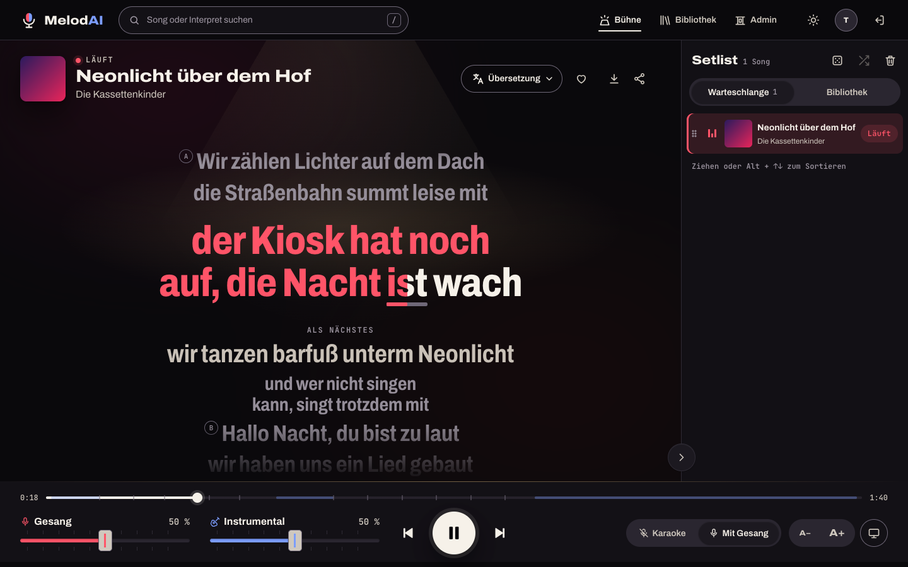
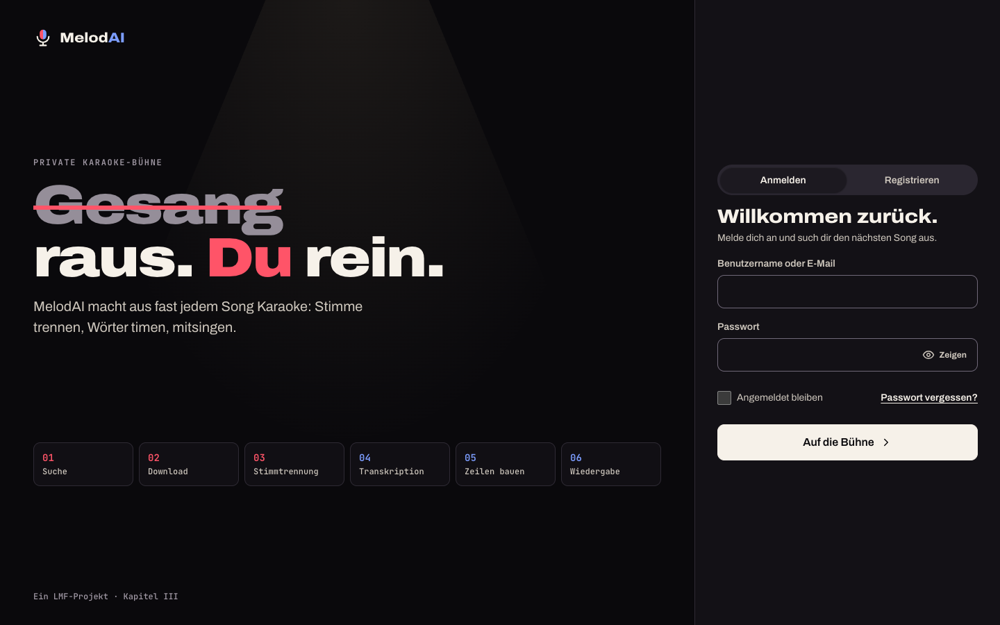
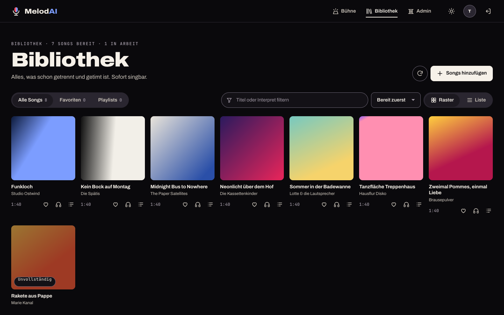
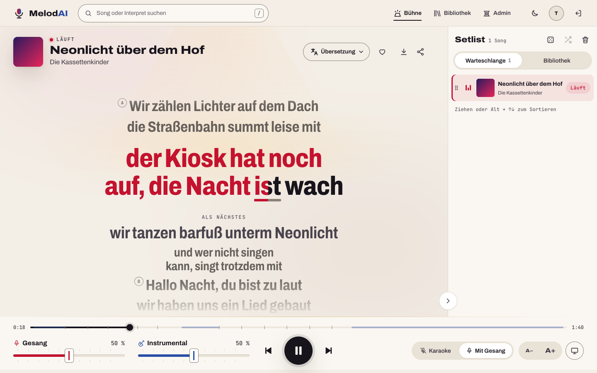
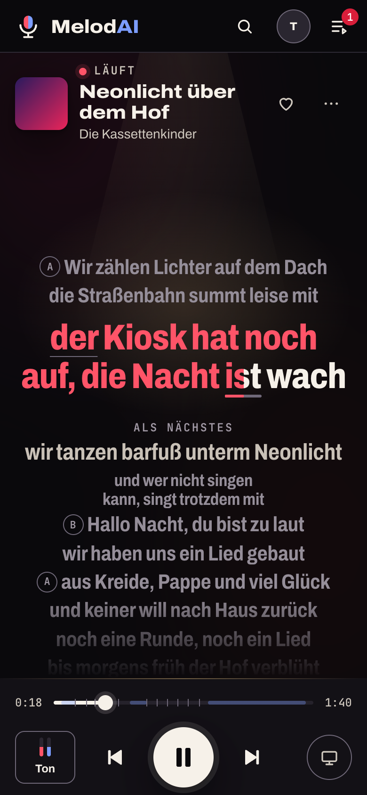
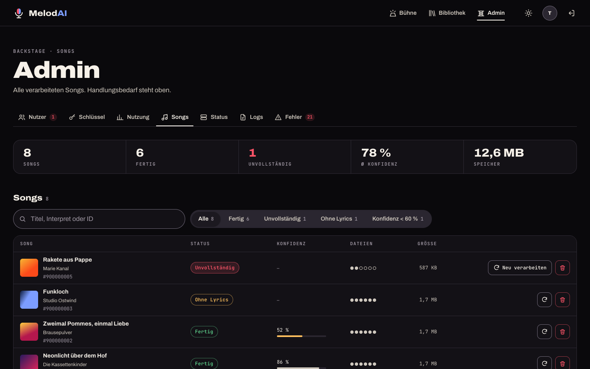
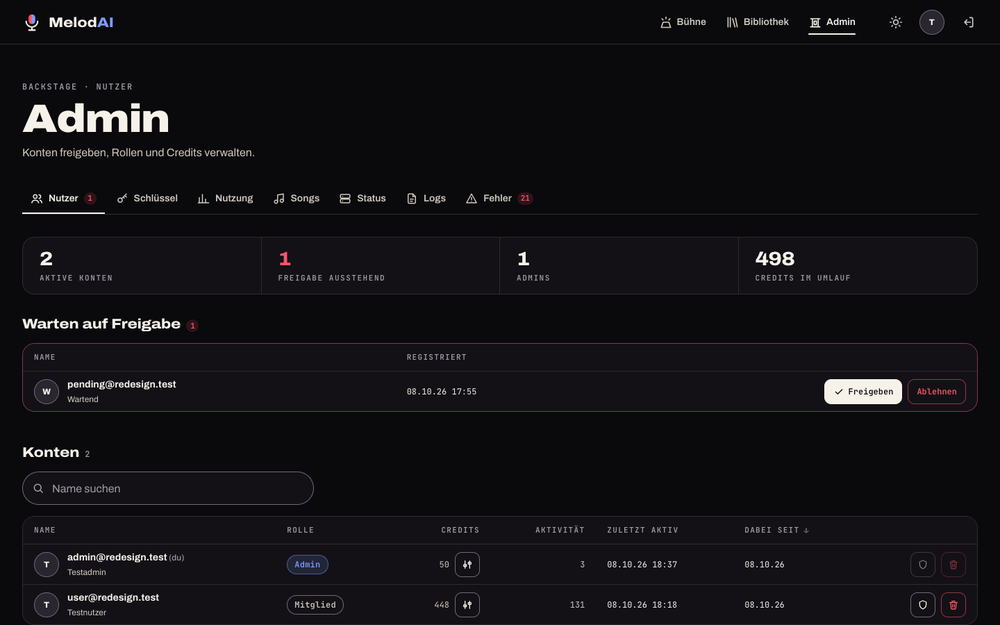
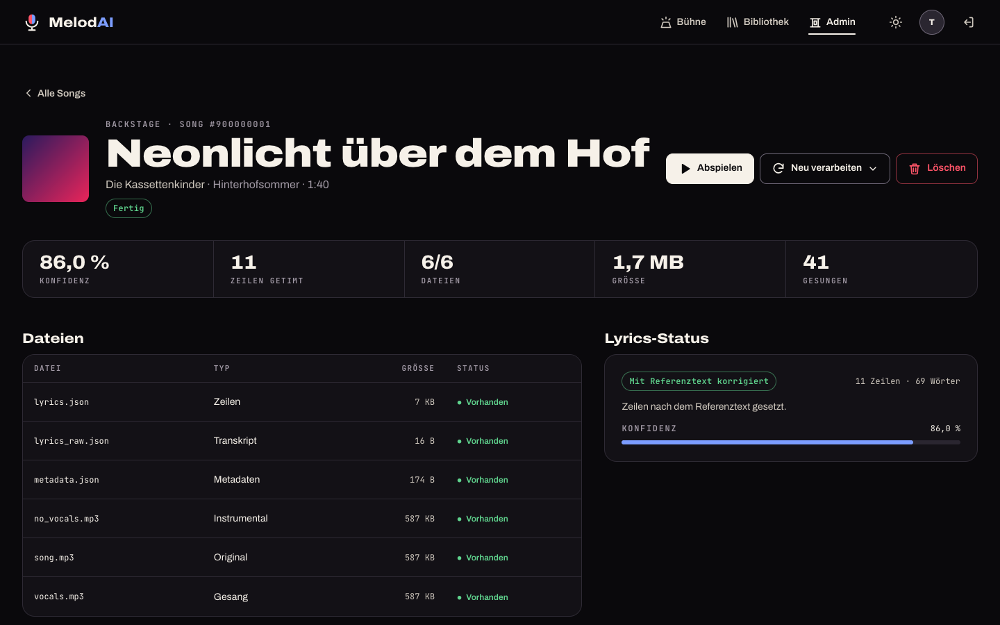
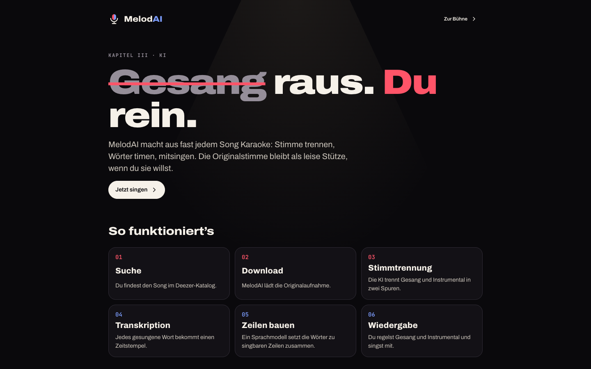

# MelodAI

[](https://github.com/LoggeL/MelodAI/actions/workflows/ci.yml)
[](https://github.com/LoggeL/MelodAI/actions/workflows/codeql.yml)
[](LICENSE)
[](https://www.typescriptlang.org/)
[](https://flask.palletsprojects.com/)

**Open-source AI karaoke pipeline for vocal separation, timed lyrics, and synchronized playback.**

Search for a song, and MelodAI separates vocals from instrumentals, extracts word-level timed lyrics, and presents a synchronized karaoke player.

[Live demo](https://melodai.logge.top/about) · [Security policy](SECURITY.md) · [Contributing](CONTRIBUTING.md)



## How It Works

1. **Search** for a song via Deezer's catalog
2. **Download** and decrypt the audio
3. **Split** vocals and instrumentals locally on the CPU with [turbo-roformer](https://github.com/LoggeL/turbo-roformer) (BS-RoFormer, about 0.7× real time on an 8-core Zen 4)
4. **Transcribe** lyrics with word-level timestamps locally on the CPU with [turbo-lyrics](https://github.com/LoggeL/turbo-lyrics) (Whisper large-v3-turbo + wav2vec2 alignment, or forced alignment of known lyrics)
5. **Process** lyrics into karaoke lines using an LLM (via OpenRouter)
6. **Play** with real-time word-highlighting, independent vocal/instrumental volume, and speaker colorization

## Screenshots

Screenshots use a demo song store with self-written lyrics.

| Login | Library |
|-------|---------|
|  |  |

| Light theme | Phone |
|-------------|-------|
|  |  |

| Admin - Songs | Admin - Users |
|---------------|---------------|
|  |  |

| Song Detail | About |
|-------------|-------|
|  |  |

## Tech Stack

- **Backend:** Python 3.12, Flask, SQLite
- **Frontend:** React, TypeScript, Vite, CSS Modules with design tokens, self-hosted Archivo and JetBrains Mono
- **Audio:** Web Audio API with dual GainNodes (vocals + instrumental)
- **Vocal separation:** local BS-RoFormer via turbo-roformer (CPU, PyTorch)
- **Transcription:** local Whisper + wav2vec2 alignment via turbo-lyrics (CPU)
- **AI Services:** GPT-6 Luna through OpenAI or OpenRouter (lyrics correction and translation)
- **Song Source:** Deezer

## Setup

### Prerequisites

- Python 3.12+ with [uv](https://docs.astral.sh/uv/)
- Node.js 22+
- API keys for: OpenAI or OpenRouter, Deezer ARL cookie
- Optional: Resend (for password reset emails)

### Installation

```bash
# Clone and install dependencies
git clone <repo-url> && cd MelodAI
uv sync
cd frontend && npm ci
```

Local separation and transcription are optional extras (CPU-only PyTorch, about 1 GB, plus about 3 GB of models for
transcription). Without them, audio processing is unavailable:

```bash
uv sync --extra separation --extra transcription   # turbo-roformer, turbo-lyrics + torch (CPU wheel)
```

The Docker image always includes both, downloads the models and compiles the AVX512-BF16 kernels at build time.

Audio separation and transcription run exclusively locally. There are no Replicate uploads, predictions, or
health requests. A local worker or output-check failure stops processing and refunds charged processing credits.
Legacy backend settings cannot enable cloud audio processing.

### Configuration

Copy `example.env` to `.env` and fill in your API keys:

```
DEEZER_ARL=<your deezer ARL cookie>
HF_READ_TOKEN=<your huggingface token>
OPENAI_API_KEY=<your OpenAI key, preferred when set>
OPENROUTER_API_KEY=<alternative OpenRouter key>
RESEND_API_KEY=<optional, for password reset emails>
```

Lyrics correction and translations use GPT-6 Luna. `OPENAI_API_KEY` sends requests directly to OpenAI;
without it, `OPENROUTER_API_KEY` sends them through OpenRouter. Set at least one. Translations can use a
different model through `LYRICS_TRANSLATION_MODEL`; non-OpenAI models require OpenRouter. Provider and model
are recorded with each result. A failed request is not automatically repeated on the other provider.

### Running

```bash
# Backend (port 5000)
uv run python main.py

# Frontend dev server (port 3000, proxies API to Flask)
cd frontend && npm run dev

# Production build (serves from Flask directly)
cd frontend && npm run build
```

### Testing

The default regression suites run locally without provider credentials or a running server:

```bash
uv run python -m unittest discover -s tests -v
cd frontend
npm test                    # Frontend request, queue and playback regressions
npm run test:integration     # Starts a disposable offline Flask server
npm run lint
npm run build
```

The integration runner creates temporary users, a database, and synthetic songs. It blocks external network calls and removes its fixtures when finished. CI runs these checks.

Browser tests require an isolated server and explicit `E2E_BASE_URL`, `E2E_ADMIN_USER`, and `E2E_ADMIN_PASS` values. Live API integration remains available through `npm run test:integration:live`. The paid pipeline suite also requires `E2E_ALLOW_PAID_PIPELINE=1`, `E2E_DEDICATED_PIPELINE_SERVER=1`, and fresh storage on an explicit loopback URL.

See [backend configuration and testing](docs/backend.md) and [offline integration tests](frontend/e2e/README.md) for setup and runtime limits.

## Architecture

```
MelodAI/
  main.py                  # Entry point
  src/
    app.py                 # Flask factory (create_app)
    routes/
      auth.py              # Login, register, password reset
      track.py             # Search, process, play (6-stage pipeline)
      admin.py             # User/song management, analytics
      static.py            # SPA serving + song file serving
    services/
      deezer.py            # Deezer API client + decryption
      lyrics.py            # LLM-based lyrics line splitting
      separation.py        # Local separation client, worker supervision, stem install
      separation_worker.py # Long-lived separation process (turbo-roformer)
      transcription.py     # Local transcription client and record
      transcription_worker.py # Long-lived transcription process (turbo-lyrics)
      compute_gate.py      # CPU gate shared by both workers
    tools/
      resplit.py           # Resumable batch: re-split all songs locally
    utils/
      helpers.py           # Lyrics post-processing pipeline
  frontend/
    src/
      hooks/usePlayer.ts   # Core audio engine (Web Audio API)
      components/Player/   # Karaoke display, controls
      pages/               # Login, Library, Admin, About
      services/api.ts      # API client layer
```

## Maintainer workflows

MelodAI has real ongoing maintenance surface area:

- reviewing and testing frontend/player changes
- triaging processing failures across Deezer, the local audio workers, and the lyrics provider
- hardening auth, admin routes, file serving, and credit accounting
- improving release confidence with CI, integration tests, and browser tests
- documenting operational edge cases for self-hosted deployments

Codex-style coding and review workflows are especially useful here because changes often span Python routes, external AI APIs, React state, audio playback, and end-to-end tests.

## License

MIT — see [LICENSE](LICENSE).
